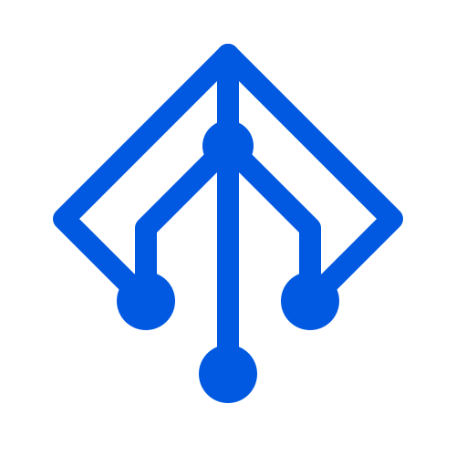

# Scion

A tiny, standalone tool for orchestrating **Claude Code** agents across
isolated git worktrees. No Docker, Postgres, Electric, Caddy, auth, or
cloud account. Everything lives under `~/.scion/`.

Two front ends over the same engine:
- A **terminal UI** (`bun start`) — see the [User Guide](docs/USER_GUIDE.md).
- A **web UI** (`bun run web:dev`) — live terminals, a status dashboard, diffs,
  and a file browser in the browser. See the [Web Guide](docs/WEB_GUIDE.md).

MIT licensed — see [LICENSE](LICENSE).

## Requirements

- **Node 18+** (runtime; the app runs under Node via `tsx`)
- A package manager to install deps — `bun`, `npm`, or `pnpm`
- `git`, `gh`
- The `claude` CLI, already logged in

> Why Node and not Bun? `node-pty` (which spawns the agent terminals) and
> `better-sqlite3` both rely on native bindings that don't load under Bun today,
> so the app runs under Node.

## Run

```bash
bun install           # or: npm install
bun run db:generate   # once, to produce the SQLite migrations
```

Then pick a front end:

```bash
bun start             # terminal UI — runs `tsx src/index.tsx` (Node runtime)

bun run web:dev        # web UI, development — backend + Vite dev server (HMR)
bun run web            # web UI, production   — builds once, serves everything on one port
```

First run (either front end) installs Claude Code lifecycle hooks into
`~/.claude/settings.json` (merged, not clobbered) and writes
`~/.scion/hooks/notify.sh`, so the dashboard can show live agent status.

Full usage: [User Guide](docs/USER_GUIDE.md) (terminal UI) ·
[Web Guide](docs/WEB_GUIDE.md) (web UI).

Agent status: `working` (turn running) · `waiting` (needs input) · `review`
(turn finished, unseen) · `idle` · `starting` · `done`.

## What it doesn't do

A background daemon (auto-spawned the first time either front end needs a
PTY) owns every live agent process independently of the terminal UI and the
web server. That means **both front ends can run at once** against the same
`~/.scion/host.db`, a workspace started in one is attachable from the other,
and restarting either front end never kills a live agent. Real limitations
that remain:

- **A crash of the daemon itself still ends every live agent's process**
  (closing its socket SIGHUPs every PTY it owns) — worktrees, branches, and DB
  state are untouched, but the live terminal is gone and you'll resume rather
  than reattach. Surviving a daemon crash too would need real fd-passing, a
  separate effort.
- **No cloud sync** — everything lives in `~/.scion/host.db` and plain
  worktrees on disk, on one machine.
- **PR creation, not PR review.** The web UI can push a branch and open a
  GitHub PR via `gh` (one click); there's no in-app PR viewing/commenting/
  approval flow. Merging back (`m` / **Merge**) is always local, straight into
  your base branch.
- 7 agent CLI presets exist (Claude Code, Gemini CLI, Codex, Cursor Agent,
  Droid, OpenCode, GitHub Copilot), configurable as the default in the web
  UI's Settings — but only Claude Code reports live `working`/`waiting`/
  `review` status via lifecycle hooks; the others just show `working` for the
  life of the session.
